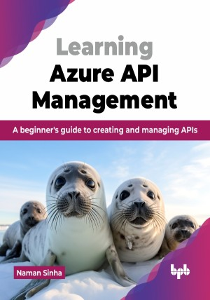

# Learning Azure API Management

A beginner's guide to creating and managing APIs.

This is the repository for [Learning Azure API Management
](https://bpbonline.com/products/learning-azure-api-management?variant=44062547607752),published by BPB Publications.

## About the Book
Azure API Management is a powerful platform that facilitates developers and organizations to create, manage, and secure APIs. This book will guide you through the entire API lifecycle, from designing and developing APIs to publishing, managing, and securing them.

This guide to Azure API Management offers a detailed exploration of the platform, covering everything from basic concepts to advanced features. It teaches you how to create, manage, and secure APIs, including topics like API products, subscriptions, versions, policies, security, and user management. Filled with practical examples and hands-on exercises, it is perfect for developers and IT professionals aiming to build and manage reliable APIs using Azure. The step-by-step instructions and clear explanations make it easy to master Azure API Management and achieve your API development goals. 

With a focus on practical application, this guide goes beyond theory, giving you the tools and knowledge you need to tackle real-world challenges. By the end of this book, you will be equipped with the skills to build and manage robust APIs that drive business success, making it an essential resource for anyone working in today's API-driven landscape.

## What You Will Learn
• Build and deploy a simple web API in .NET Core and Azure.

• Set up an enterprise-grade API ecosystem, scale efficiently, and manage large APIs using the infrastructure and deployment options.

• Monitor APIs using the monitoring section's crucial insights about API performance and usage.

• Safe updates and transparent API evolution using the versions and revisions feature.

• Ensure secure, consistent, and efficient API behavior using policies.
